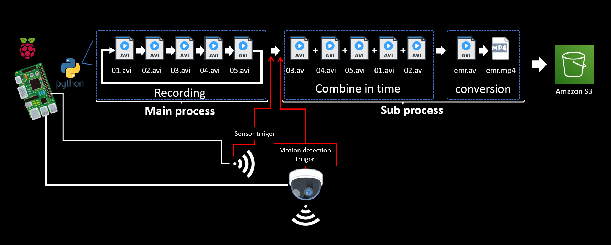

# Camera-to-watch-over-cats-with-a-raspberrypi
It is a self-made system that watches the daily life of remote families and cats with Raspberry Pi, cheap sensor, USB camera and AWS.  (日本語名：ニャンコ見守りカメラ)
<br>
## **What can be done**
Crop the video for 15 seconds before and after the event (30 seconds in total) is detected by sensor detection or camera motion detection, and upload it to Amazon S3. event You can browse the past 12 videos on your own web site.  

It can be used with the sensor monitor dashboard by deploying "System-to-watch-over-cats-with-a-raspberrypi".  

When used together, the deployment order is "System-to-watch-over-cats-with-a-raspberrypi"-> "Camera-to-watch-over-cats-with-a-raspberrypi"  

Data is not saved in DB 
<br>
<br>

## **Architecture**
<br />

<br />
<br />

## **Event recording work flow**
<br />

<br />
<br />

## **Web screen view sample**
<br />

<br />
<br />
<br />

## **Physical specifications**
### **Sensor**

For detection of objects such as people：  
* E18-D80NK  (datasheet: ./pdf/e18-d80nk.pdf)  
* HC-SR501  (datasheet: ./pdf/HC-SR501.pdf)  
<br>

#### **RaspberryPi**
Hardware: aarch64  
Model: Raspberry Pi 4 Model B Rev 1.2  
microSD card: 32GB or more
<br>
<br />

## **Development environment**
#### **RaspberryPi**
Kernel: Linux    
Kernel release No.: 5.10.92-v8+   
Kernel version: #1514 SMP PREEMPT Mon Jan 17 17:39:38 GMT 2022 aarch64  
OS： Raspbian GNU/Linux 11 (bullseye)  
Language: python 3.9.2
#### **Windows**
Editor: VSCode  
VSCode expantions: Python、Pylance、MagicPython、GitLens、Git Histry、Git Graph、Markdown All in One、Excel to Markdown table  
SCP client: WinSCP ver. 5.19  
SSH terminal client: TeraTerm ver. 4.105  
<br>
<br>

## **Construction procedure**

### **Preparation**
1.  Prepare RaspberryPi OS image disc.  https://www.raspberrypi.com/software/
2.  Prepare an aws account.
3.  Prepare IAM user with 8 custom managed policies of ./user_policy and AWSIoTFullAccess attached, or IAM user with administrator authority attached so that both console login and access key can be used. You must replace "accountID" to your accountID in 8 policies.
4. Download access key ID and secret access key.
5. Connect the motion sensor (if necessary) as shown in the Architecture.
6. Insert the OS image disc into the Raspberry Pi and turn on the power.
7. Make initial settings for Raspberry Pi and connect to the Internet.
<br>
<br>
<br>

### **Building an common environment on Raspberry Pi**
Launch Raspberry Pi that can connect to the Internet.  
  
  
Clone this project from public repository
```sh  
git clone https://github.com/nsaito9628/Camera-to-watch-over-cats-with-a-raspberrypi.git
```
  
Deploy a project  
``` sh
cp -r ./Camera-to-watch-over-cats-with-a-raspberrypi/src/* ~
```

Download and unpack the required packages
```sh
sudo chmod u+x environment.sh
./environment.sh
```
  
<br>
<br>

### **Used without "System-to-watch-over-cats-with-a-raspberrypi"**
  
Set aws configuration as default profile  
```sh
aws configure (Replace with your own key)  
    AWS Access Key ID[]: your Access Key ID
    AWS Secret Access Key []: your Secret Access Key
    Default region name []: ap-northeast-1
    Default output format []:
```
  
Customize parameters (if needed)  
``` sh
sudo nano iot_prov_config
```
Parameters customizable as below 
>SENSOR_NO  
S3BUCKET  
PREFIX_IN1  
PREFIX_IN2 (The value is blank when not in use)  
PREFIX_IN3 (The value is blank when not in use)  
PREFIX_IN4 (The value is blank when not in use)
  
Registration of RaspberryPi as a thing to IoT core and automatic startup setting
```sh
sudo chmod u+x iot_prov_cam.sh
./iot_prov_cam.sh
```  

<br>
<br>

### **Used with "System-to-watch-over-cats-with-a-raspberrypi"**

Customize parameters (if needed)  
``` sh
sudo nano iot_prov_config
```
Parameters customizable as below 
>SENSOR_NO  
S3BUCKET  
PREFIX_IN1  
PREFIX_IN2 (The value is blank when not in use)  
PREFIX_IN3 (The value is blank when not in use)  
PREFIX_IN4 (The value is blank when not in use)
  
Registration of RaspberryPi as a thing to IoT core and automatic startup setting
```sh
sudo chmod u+x iot_prov_all.sh
./iot_prov_all.sh
```  
<br>
<br>

### **Comment out / uncomment parameters according to the number of cameras used**
```sh
sudo nano parameters.py
```  
Comment out or uncomment lines 30 to 33.  
```sh
sudo nano emr_rec.py
```  
Change "X" of PREFIX_IN "X" on line 27 to match camera No.  
```sh
sudo nano emr_gen.py
```  
Change "X" of PREFIX_IN "X" on line 18 to match camera No.  

<br>
<br>

### **Deploying SAM template on Raspberry Pi**  

Rewrite to your own parameters(if needed)

```sh
cd ../Camera-to-watch-over-cats-with-a-raspberrypi/template
sudo nano tmplate.yaml   
```
Parameters customizable as below  
>NameTag  
        OrgBucketName (is as same as S3BUCKET)  
        FuncName  
        Cam0 (is as same as PREFIX_IN1)  
        Cam1 (is as same as PREFIX_IN2.  Comment out Parameters and environment variables for Lambda functions when not in use)  
        Cam2 (is as same as PREFIX_IN3.  Comment out Parameters and environment variables for Lambda functions when not in use)  
        Cam3 (is as same as PREFIX_IN4.  Comment out Parameters and environment variables for Lambda functions when not in use)
  
If you want to customize the parameters, change the following directory name to the same as PREFIX_IN.  
>bed1 --> PREFIX_IN1  
bed2 --> PREFIX_IN2  
bed3 --> PREFIX_IN3  
tableside --> PREFIX_IN4
  

Also, you must change directory names (and S3 biucket name if needed ) in ./template/mimamori-project-deploy.sh.  
<br>
  
Deploy CloudFormation stack
```sh
sam build
sam deploy --guided --capabilities CAPABILITY_NAMED_IAM

    #Enter any stack name and [Y/N]  
        Stack Name [sam-app]: any-stack-name  
        AWS Region [ap-northeast-1]:  
        Parameter NameTag [mimamori]:  
        Parameter OrgBucketName [my-mimamori-bucket]:  
        Parameter Prefix [emr]:  
        Parameter FuncName [MyMimamoriFunc]:  
        Parameter Cam0 [bed1]:  
        Confirm changes before deploy [y/N]: Y  
        Allow SAM CLI IAM role creation [Y/n]: Y  
        Disable rollback [y/N]: y  
        Save arguments to configuration file [Y/n]: Y  
        SAM configuration file [samconfig.toml]:  
        SAM configuration environment [default]:  
        ・  
        ・  
        ・  
        Deploy this changeset? [y/N]: y
```
Confirm message like "Successfully created/updated stack - any-stack-name in ap-northeast-1"  

Open a web page with CloudFront URL
<br />

<br />
<br />
Select trigger for event recording
```sh
cd ..
sudo nano emr_rec.py
```
When setting the logic signal of the sensor to trigger, uncomment lines 79 and 89 then comment out lines 80 and 90.  
<br />

<br />

When setting the motion detection of the camera to trigger, uncomment lines 80 and 90 then comment out lines 78 and 89.  
<br />

<br />

Place the camera in place and restart the Raspberry Pi.  
```sh
sudo reboot
```
